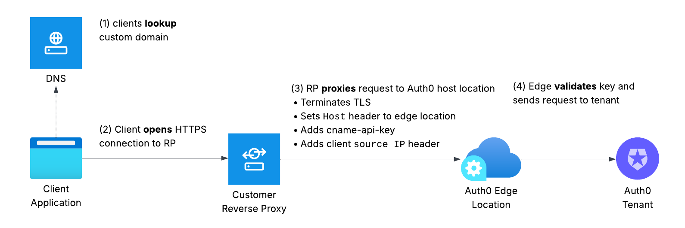
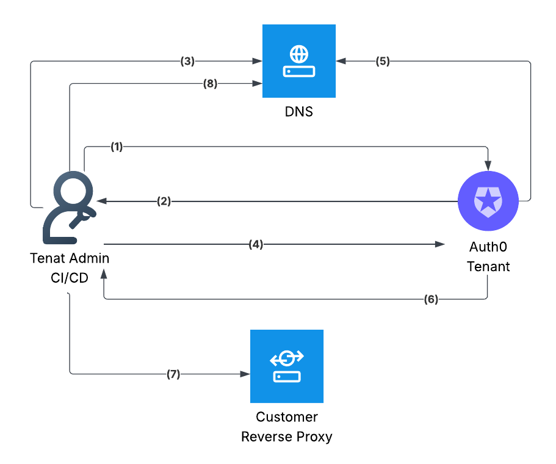
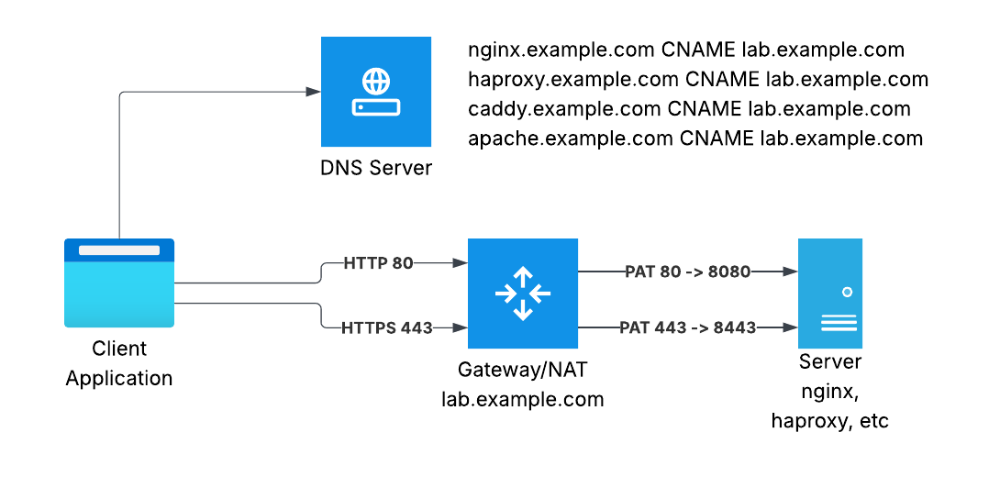

# Auth0 Custom Domain Reverse Proxy Collection

This repository provides practical examples and guidance on how to set up Auth0 self-managed custom domains with
different proxy servers. It includes configuration examples for multiple reverse proxy solutions and Terraform scripts
to automate the setup process.

## Supported Reverse Proxies

This repository includes configuration examples for the following reverse proxies:

- [Nginx](./nginx/README.md)
- [Apache](./apache/README.md)
- [Caddy](./caddy/README.md)
- [HAProxy](./haproxy/README.md)
- [Cloudflare](./cloudflare/README.md)
- AWS
  - [API Gateway](./terraform/aws-api-gateway.tf)
  - [CloudFront](./terraform/aws-cloudfront.tf)
- [Akamai](./akamai)

Each proxy folder contains specific configuration files, setup instructions, and a Makefile to simplify deployment.

## How It Works

### Traffic Flow

The following diagram shows how live traffic flows between client applications, the reverse proxy, and Auth0:

When a user accesses your application:

1. Client application lookups custom domain address from DNS
2. Client opens HTTPS connection reverse proxy (RP)
3. RP terminates TLS, adds headers to HTTP request and proxies them to edge location
4. Edge location validates input request and sends request to target tenant.

### Registration

The following diagram illustrates how to set up a custom domain with Auth0:

The setup process involves:

1. Admin request creating a custom domain in Auth0
2. Admin receives domain ownership proof TXT record
3. Add TXT record to your DNS
4. Request Auth0 to verify domain ownership
5. Auth0 checks DNS and marks domain as verified
6. Auth0 returns Edge location and `cname-api-key` to administrator
7. Admin updates reverse proxy with values from step 6
8. Admin updates DNS so that custom-domain point to reverse proxy

### TLS Termination

This project is using free TLS certificates from [Let's Encrypt](https://letsencrypt.org/).

### Lab Setup

All hosted reverse proxy server been test on Linux Mint 22.1.

| Reverse Proxy   | Tested version   | Client IP Header   | 
|-----------------|------------------|--------------------| 
| Apache2         | 2.4.58           | `x-forwarded-for`  |
| Caddy           | 2.6.2            | `x-forwarded-for`  |
| Nginx           | 1.24.0           | `x-forwarded-for`  |
| HAProxy         | 2.8.5-1ubuntu3.3 | `x-forwarded-for`  |
| Cloudflare      | -                | `cf-connecting-ip` |
| AWS API Gateway | v2               | `x-forwarded-for`  |
| AWS CloudFront  | -                | `x-forwarded-for`  |
| Akamai          | Property Manager | `true-client-ip`   |

## Reference API

See [Custom Domains management API](https://auth0.com/docs/api/management/v2/custom-domains/get-custom-domains) for
reference.

## Terraform Examples

This repository includes Terraform scripts to automate the setup of Auth0 custom domains and the necessary
infrastructure for each proxy server. The Terraform examples:

- Create Auth0 custom domains
- Set up DNS records
- Generate SSL certificates
- Create configuration files for each proxy server

To use the Terraform examples:

1. Navigate to the `terraform` directory
2. Configure your Auth0 and DNS provider credentials
3. Run `terraform apply`

For more details, see the [Terraform README](./terraform/README.md).

## Getting Started

To get started with this repository:

1. Choose a reverse proxy solution that fits your needs
2. Navigate to the corresponding directory
3. Follow the setup instructions in the README.md file
4. Use the provided Makefile to deploy the solution

## MTLS Proof of Possession

TBA

## License

This project is licensed under the Apache License 2.0 - see the [LICENSE](./LICENSE) file for details.

## Contributing

Contributions are welcome! Please feel free to submit a Pull Request.